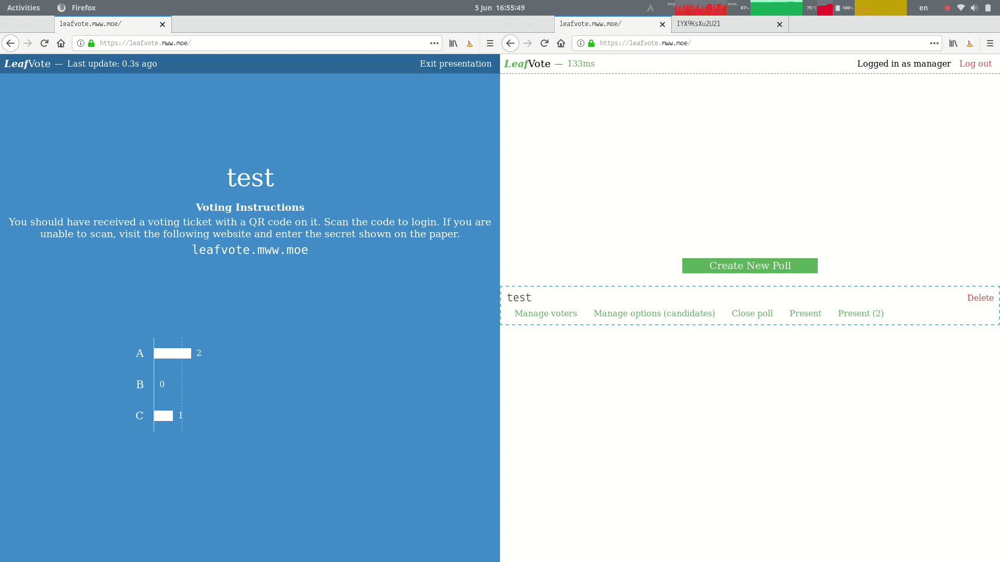

## Real-time voting & presenting result on big screen.

### Workflow

- Organizer set up poll and options, and generate one secret for each voter
- Organizer export and print voting tickets (or other distribution method) so that voters get their secrets
- Organizer present the poll result on screen, and in the mean time&hellip;
- Voters scan their QR code (or otherwise enter their secret on leafvote website), and choose which option to vote.
- Result updates real-time on organizer's screen.

### Demos

Voting ticket (one for each voter) generation: Export voting ticket tex -> latex & dvipdf (pdflatex is not supported because PSTricks)

Vote & presentation interface: \

Open/close poll (allowing/disallowing voting): \

Try at https://leafvote.mww.moe \
Contact m@maowtm.org if you have thousands of voters or more and are planning to use this server.
